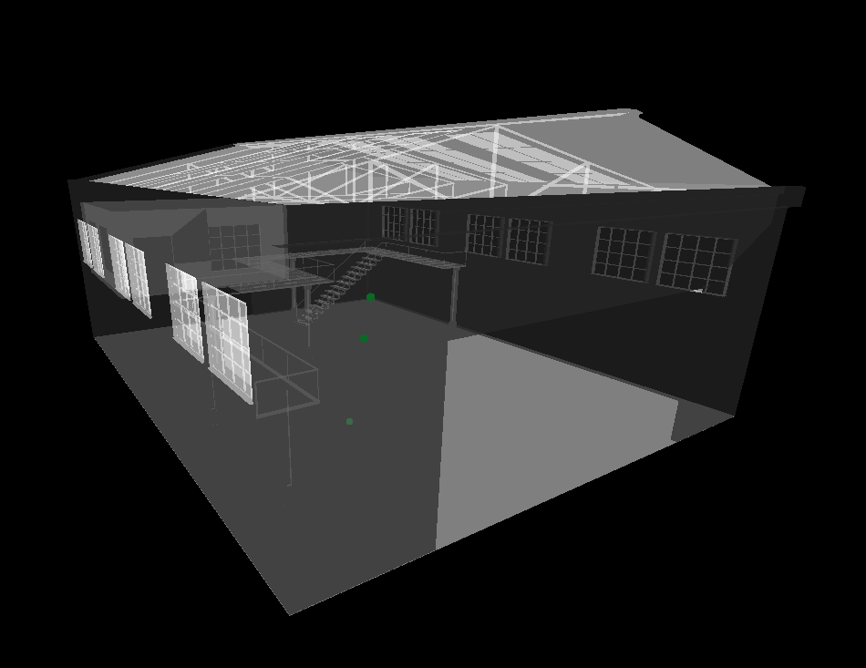

# ThreeJS_3D-Viewer

This is a real-time 3D viewer built with three.js and lidar sensors. The viewer renders staff locations within a warehouse to improve management.



## Table of Contents ##

- [Prerequisites](#prerequisites)
- [Usage](#usage)
- [Author](#author)

## Prerequisites <a name = "prerequisites"></a> ##

* Install live-server in command line:

```bash
$ npm install -g live-server
```

## Usage <a name = "usage"></a> ##

1. Switch to the project directory.

```bash
$ cd ThreeJS_3D-Viewer
```

2. Start the 3D viewer with live-server.

```bash
$ live-server
```

## Who do I talk to <a name = "author"></a> ##
* Jeffrey Wang (jeffrey.wanggg@gmail.com)
